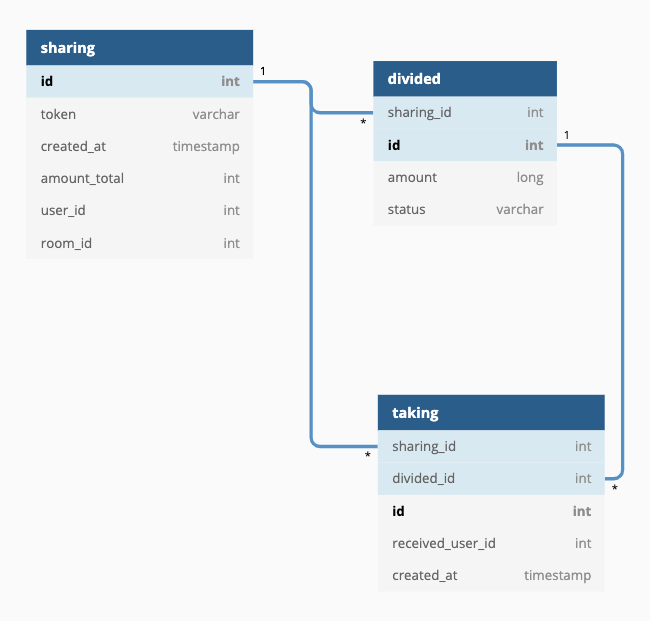

# 뿌리기 API

## 요구사항
   - 뿌리기, 받기, 조회 기능을 수행하는 REST API 를 구현합니다.
        * 요청한 사용자의 식별값은 숫자 형태이며 "X-USER-ID" 라는 HTTP Header 로 전달됩니다.
        * 요청한 사용자가 속한 대화방의 식별값은 문자 형태이며 "X-ROOM-ID" 라는
        HTTP Header 로 전달됩니다.
        * 모든 사용자는 뿌리기에 충분한 잔액을 보유하고 있다고 가정하여 별도로 잔액에 관련된 체크는 하지 않습니다.
   -  작성하신 어플리케이션이 다수의 서버에 다수의 인스턴스로 동작하더라도 기능에 문제가 없도록 설계되어야 합니다.
   - 각 기능 및 제약사항에 대한 단위테스트를 반드시 작성합니다.

## 개발 환경
   - Java8
   - Spring Boot 2.3.4.RELEASE
   - JPA
   - H2
   
## 실행
```shell script
./gradlew clean jar build

java -jar ./build/libs/service-sharing-money-1.0.0-SNAPSHOT.jar
```

## 개발 노트
1. 고민 사항
    - 뿌리기 API 의 token 발급 중복 동시성 이슈
        * ```sharing``` table unique key 이용
    - 받기 API 의 동시성 이슈
        * ```taking``` table unique key 이용
    - 데이터에 대한 시간 유효성 체크(10분, 7일 등)
        * 데이터 생성 시간 기반으로 서비스 단에서 로직으로 처리
    
2. 테이블 설계
    - 발급된 토큰 저장(sharing), 분배된 금액 저장(distribution), 가져간 금액 저장(taking)
    - [다이어그램](https://dbdiagram.io/d/5f7f206c3a78976d7b76e1e5)  
    
    
3. 비지니스 로직
    - 뿌리기 API
        1. token 을 생성하여 ```sharing``` table 에 insert
        2. 전체 금액 분할하여 ```distribution``` table 에 insert
        
    - 받기 API
        1. ```distribution``` table 에서 분할된 것 중 하나를 가져와 ```taking``` table 에 insert
        2. ```distribution``` table 의 상태를 update
    
    - 조회 API
        1. token 값으로 ```sharing```,  ```distribution``` table 조회
    